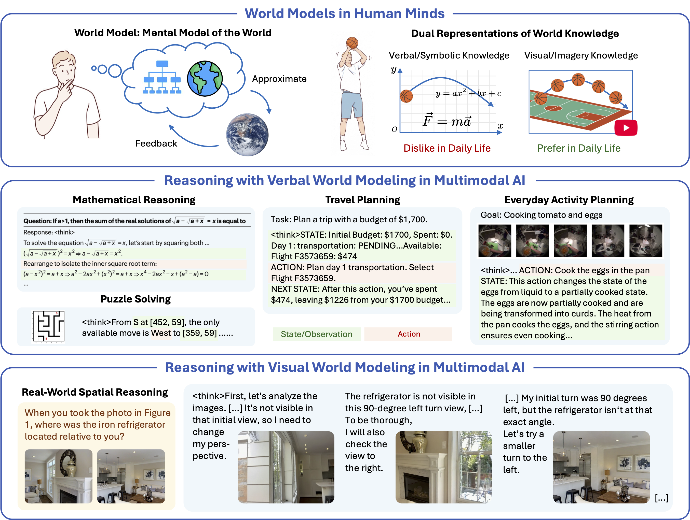

# Visual Generation Unlocks Human-Like Reasoning through Multimodal World Models 🌏

[](https://thuml.github.io/Reasoning-Visual-World/)
[](https://arxiv.org/abs/2601.19834)
[](https://github.com/thuml/Reasoning-Visual-World)
[](https://huggingface.co/datasets/thuml/VisWorld-Eval)

This is the official code base for the paper [Visual Generation Unlocks Human-Like Reasoning through Multimodal World Models](https://arxiv.org/abs/2601.19834).

Give it a star 🌟 if you find our work useful!

## 📋 Introduction

**TL;DR**: From a world-model perspective, we study when and how visual generation enabled by unified multimodal models (UMMs) benefits reasoning.



Humans construct mental models of the world, representing information and knowledge through two complementary channels—verbal and visual—to support reasoning, planning, and decision-making. In contrast, recent advances in large language models (LLMs) and vision–language models (VLMs) largely rely on verbal chain-of-thought reasoning, leveraging primarily symbolic and linguistic world knowledge. Unified multimodal models (UMMs) open a new paradigm by using visual generation for visual world modeling, advancing more human-like reasoning on tasks grounded in the physical world.

In this work:

- We formalize the atomic capabilities of world models and world model-based chain-of-thought reasoning.
- We highlight the richer informativeness and complementary prior knowledge afforded by visual world modeling, leading to our *visual superiority hypothesis* for tasks grounded in the physical world.
- We identify and design tasks that necessitate interleaved visual-verbal CoT reasoning, constructing a new evaluation suite, *VisWorld-Eval*.
- Through controlled experiments on BAGEL, we show that interleaved CoT significantly outperforms purely verbal CoT on tasks that favor visual world modeling, strongly supporting our insights.

For more details, check our [project page](https://thuml.github.io/Reasoning-Visual-World/) or [paper](https://arxiv.org/abs/2601.19834).

## 🏆 VisWorld-Eval: Task Suite for Reasoning with Visual World Modeling

The VisWorld-Eval suite is for assessing multimodal reasoning with visual world modeling. It comprises seven tasks spanning both synthetic and real-world domains, each designed to isolate and demand specific atomic world-model capabilities.

| Task                         | Capability      | Domain      | Test Samples | Source / Reference              |
|------------------------------|-----------------|-------------|--------------|--------------------------------|
| Paper folding                | Simulation      | Synthetic   | 480          | [SpatialViz](https://github.com/wangst0181/Spatial-Visualization-Benchmark)              |
| Multi-hop manipulation       | Simulation      | Synthetic   | 480          | [ZebraCoT](https://arxiv.org/abs/2507.16746), [CLEVR](https://github.com/facebookresearch/clevr-dataset-gen)    |
| Ball tracking                | Simulation      | Synthetic   | 1,024        | [RBench-V](https://github.com/CHEN-Xinsheng/VLMEvalKit_RBench-V)          |
| Maze                          | Simulation      | Synthetic   | 480          | [maze-dataset](https://github.com/understanding-search/maze-dataset)          |
| Sokoban                       | Simulation      | Synthetic   | 480          | [Game-RL](https://github.com/tongjingqi/Game-RL)                 |
| Cube 3-view projection        | Reconstruction  | Synthetic   | 480          | [SpatialViz](https://github.com/wangst0181/Spatial-Visualization-Benchmark)              |
| Real-world spatial reasoning | Reconstruction  | Real-world  | 522          | [MMSI-Bench](https://github.com/InternRobotics/MMSI-Bench)             |

### Load Data

Load from 🤗 HuggingFace:

```python
from datasets import load_dataset
ds = load_dataset("thuml/VisWorld-Eval")
```

### Evaluation

We evaluate different models through API servers. Set your API key and server address in `evaluate.py` (for the evaluated model) and `task_verifiers.py` (for the model judge), then run the evaluation script.

```bash
python eval/evaluate.py --task ballgame --model gemini3pro
```

### Leaderboard

Zero-shot evaluation of advanced VLMs on VisWorld-Eval: We report the average accuracy over five tasks (excluding Maze and Sokoban) and over all seven tasks.

| Models                 | Paper Folding | Multi-Hop Manip. | Ball Tracking | Cube 3-View | MMSI (Pos. Rel.) | Maze | Sokoban | Overall (5 tasks) | Overall (7 tasks) |
|------------------------|---------------|------------------|---------------|------------|------------------|------|---------|-------------------|-------------------|
| Gemini 3 Flash         | 25.6          | **75.4**             | **55.3**          | 52.7       | 41.3             | 73.9 | **99.3**    | **50.0**              | **60.5**              |
| Gemini 3 Pro           | **27.0**          | 74.5             | 44.7          | **53.3**       | **49.6**             | 33.5 | 90.2    | 49.8              | 53.2              |
| Seed 1.8               | 10.6          | 75.2             | 24.4          | 42.5       | 38.8             | **83.9** | 68.3    | 38.3              | 49.1              |
| GPT 5.1                | 6.4           | 73.9             | 34.8          | 44.5       | 44.8             | 0.6  | 62.8    | 40.8              | 38.2              |
| o3                     | 13.5          | 68.1             | 24.7          | 37.7       | 44.4             | 0.0  | 36.0    | 37.6              | 32.0              |
| Qwen3-VL-8B-Thinking    | 11.0          | 49.3             | 17.8          | 21.2       | 27.7             | 0.0  | 5.8     | 25.4              | 18.9              |
| BAGEL-7B-MoT           | 11.2          | 31.6             | 19.4          | 26.8       | 27.2             | 0.0  | 0.2     | 23.2              | 16.6              |

## 🚀 Release Progress

- [x] VisWorld-Eval data
- [x] VisWorld-Eval evaluation scripts

## 📜 Citation

If you find this project useful, please cite our paper as:

```
@article{wu2026visual,
    title={Visual Generation Unlocks Human-Like Reasoning through Multimodal World Models}, 
    author={Jialong Wu and Xiaoying Zhang and Hongyi Yuan and Xiangcheng Zhang and Tianhao
Huang and Changjing He and Chaoyi Deng and Renrui Zhang and Youbin Wu and Mingsheng
Long},
    journal={arXiv preprint arXiv:2601.19834},
    year={2026},
}
```

## 🤝 Contact

If you have any questions, please contact wujialong0229@gmail.com.

## 💡 Acknowledgement

We sincerely appreciate the following projects for their valuable codebase and task design: [SpatialViz](https://github.com/wangst0181/Spatial-Visualization-Benchmark), [RBench-V](https://github.com/CHEN-Xinsheng/VLMEvalKit_RBench-V), [maze-dataset](https://github.com/understanding-search/maze-dataset), [Game-RL](https://github.com/tongjingqi/Game-RL), [clevr-dataset-gen](https://github.com/facebookresearch/clevr-dataset-gen), [MMSI-Bench](https://github.com/InternRobotics/MMSI-Bench).
